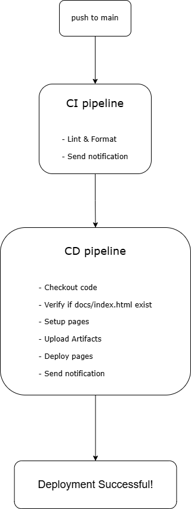
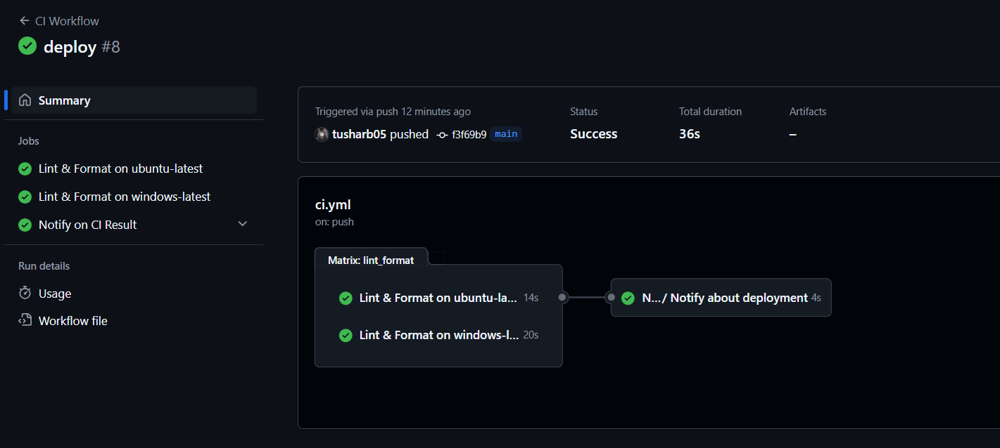
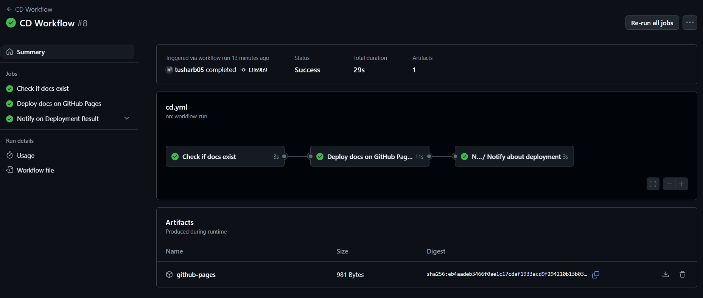
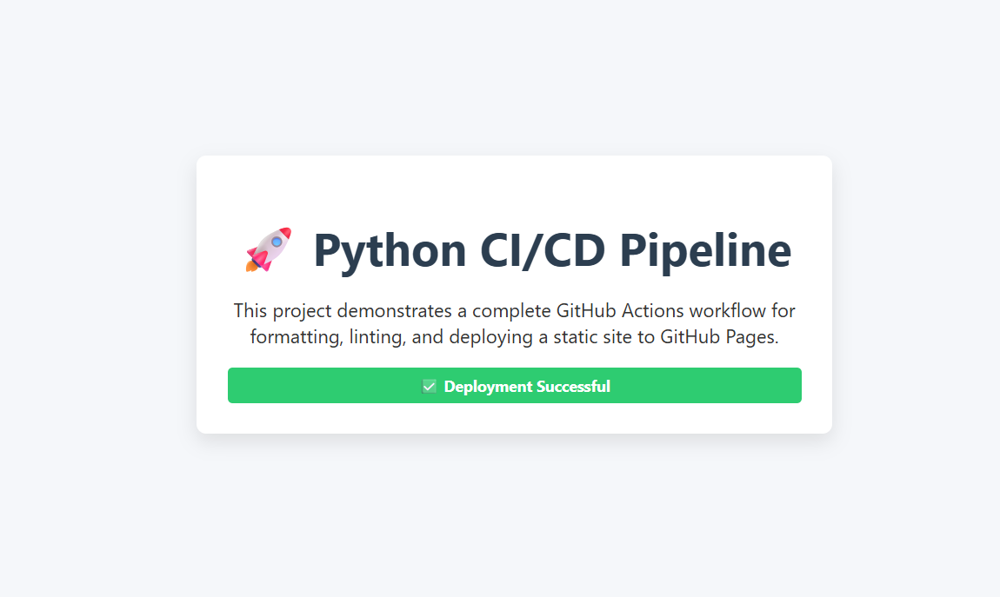
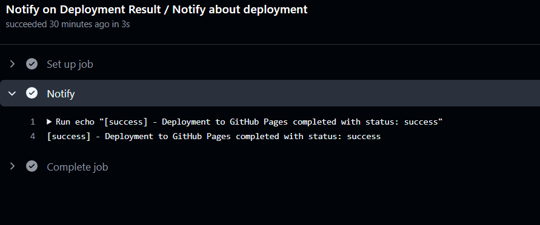

# 🚀 Python CI/CD Pipeline with GitHub Actions & Pages

## 📌 Project Overview

This project demonstrates a streamlined CI/CD pipeline for a Python application using GitHub Actions. It emphasizes code quality through linting and formatting checks and automates the deployment of static documentation to GitHub Pages upon pushing to the `main` branch.

---

## 🛠️ Technologies Used

- **Python 3.11**
- **GitHub Actions**
- **Flake8** for linting
- **Black** for code formatting
- **GitHub Pages** for hosting static content

---

## ⚙️ CI/CD Workflow



1. **Continuous Integration (CI):**

   - Triggered on every `push`.
   - Sets up Python environment.
   - Installs dependencies from `requirements.txt`.
   - Runs linting and formatting checks.

2. **Continuous Deployment (CD):**
   - Triggered on push to `main`.
   - Validates the presence of `docs/index.html`.
   - Deploys the `docs/` directory to GitHub Pages.
   - Sends a notification upon successful deployment.

---

## 📁 Project Structure

```
.
├── app/
│ └── main.py
├── docs/
│ └── index.html
├── requirements.txt
├── VERSION
├── README.md
└── .github/
└── workflows/
  ├── ci.yml
  ├── cd.yml
  └── reusable-notify.yml
```

---

## ✅ Features

- **Automated Linting:** Ensures code adheres to PEP8 standards using Flake8.
- **Code Formatting:** Maintains consistent code style with Black.
- **Matrix Builds:** Tests the application across multiple operating systems.
- **Static Site Deployment:** Publishes documentation to GitHub Pages seamlessly.
- **Reusable Workflows:** Modular notification system for CI/CD processes.

---

## 📸 Screenshots

### CI Workflow Success



### Deployed Documentation




---

## 📢 Notifications

Upon successful deployment, a notification is sent via the configured channel.



---

## 🧩 Reusable Workflows

The `reusable-notify.yml` workflow is designed to send customizable notifications based on the status of CI/CD processes.

---

